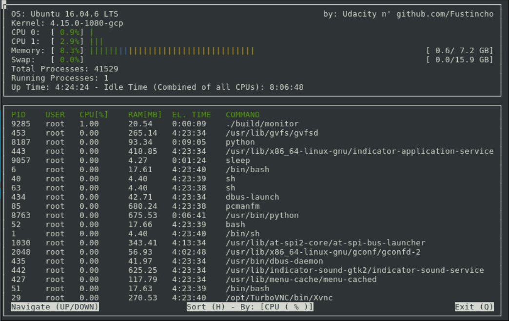

Udacity C++ Nanodegree Project 2: System Monitor (Personal Solution)
================

This repository contains the submission code for the System Monitor
project in the Object Oriented Programming Course of the [Udacity C++
Nanodegree
Program](https://www.udacity.com/course/c-plus-plus-nanodegree--nd213).

## ncurses

[ncurses](https://www.gnu.org/software/ncurses/) is a library that
facilitates text-based graphical output in the terminal. This project
relies on ncurses for display output.

To install ncurses within a Linux environment:
`sudo apt install libncurses5-dev libncursesw5-dev`

## Make

This project uses [Make](https://www.gnu.org/software/make/). The
Makefile has four targets: \* `build` compiles the source code and
generates an executable \* `format` applies
[ClangFormat](https://clang.llvm.org/docs/ClangFormat.html) to style the
source code \* `debug` compiles the source code and generates an
executable, including debugging symbols \* `clean` deletes the `build/`
directory, including all of the build artifacts

## Objective

The starter code contained the building blocks to get the app running.
The following image shows its initial state:

The objective of the project was to get the app up to the following
state:

## Submission

Besides the baseline objectives, this submission included the following
optional improvements:

### System

-   CPU usage is calculated within an interval of one second
-   CPU usage is shown per CPU. The bar changes colors depending of the
    CPU usage (green \< yellow \< red)
-   Memory usage is split into Memory and Swap, just like htop. The
    monitor also follows the color code of htop and displays the memory
    in GB as well
-   Both the CPU and Memory progress bars adapt to the window size
-   Idle time (Combined of alls CPUs) is included

### Processes:

-   CPU usage is also calculated w.r.t the usage of each second
-   Interactive Controls added

### Interactivity

-   UP/DOWN arrows let you navigate through the processes if the list
    that is displayed is smaller than the total number of PIDs active
-   The “h” key lets you sort the processes according to: PID, RAM, or
    CPU usage
-   Pressing “q” quits the program

### Command Line Arguments

-   One argument is accepted: a number \> 0 that indicates the number of
    processes to display. Without any argument, then this number is
    equal to 10. If the argument is invalid, a proper error message is
    displayed

### Submitted version

## How to run

1.  Clone the project repository

2.  Build the project: `make build`

3.  Run the resulting executable: `./build/monitor`
